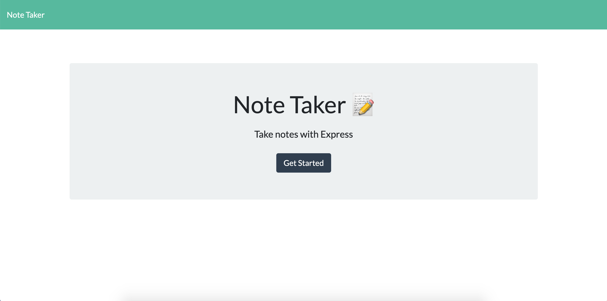
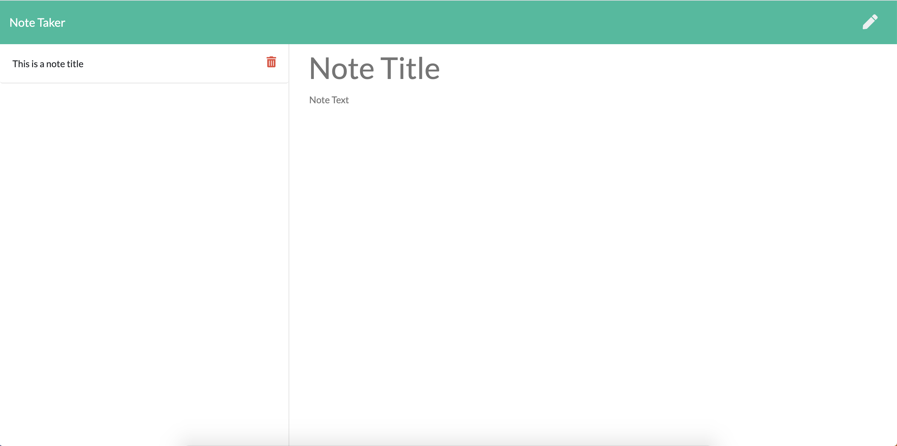
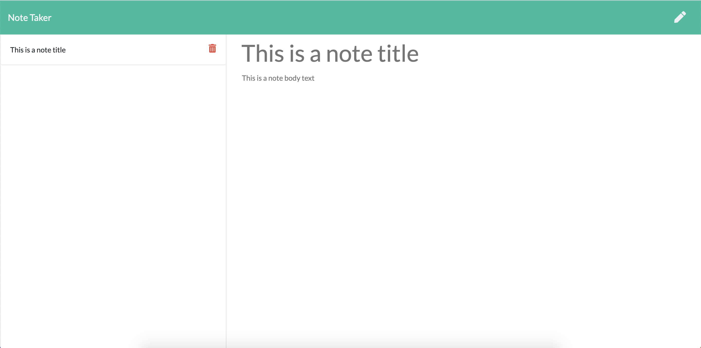

# Notetaker

This application allows you to write and save notes that can then be reviewed.

 ***

 

 ***
    
## Table of Contents
[Installation](#Installation)

[Usage](#Usage)
    
[Licensing](#Licensing)
    
***
    
## Installation
npm install

## Usage
After clicking "Get Started" from the home page, you are brought to a page where you can type in new notes with titles. When the save button is clicked, your new note is saved to the list on the side.

You can then click on previously saved notes to review their content.

    
## Licensing
No License
    
    
***
    
### Email: awhoerman@me.com

    